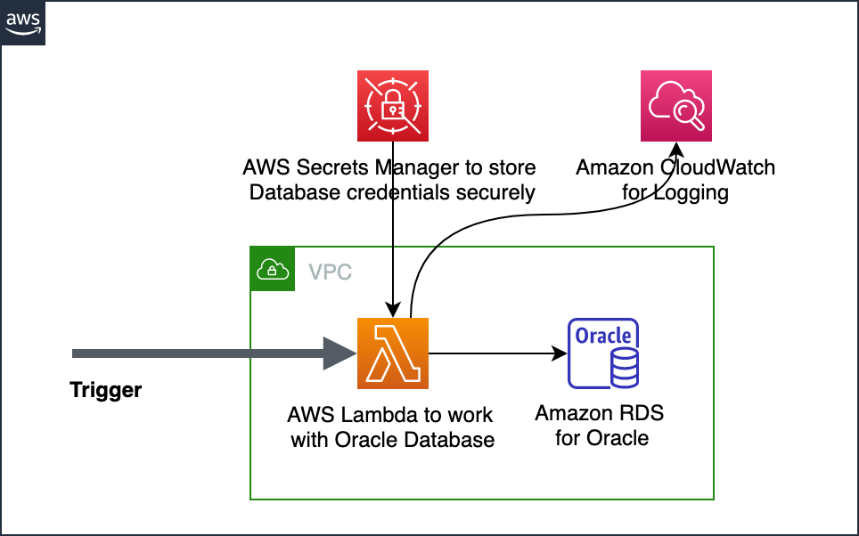
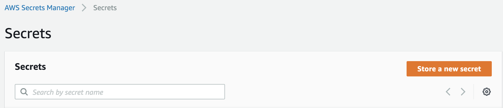
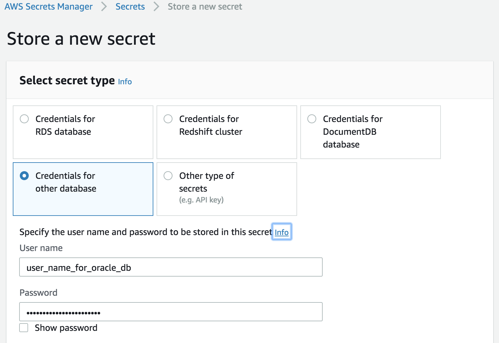
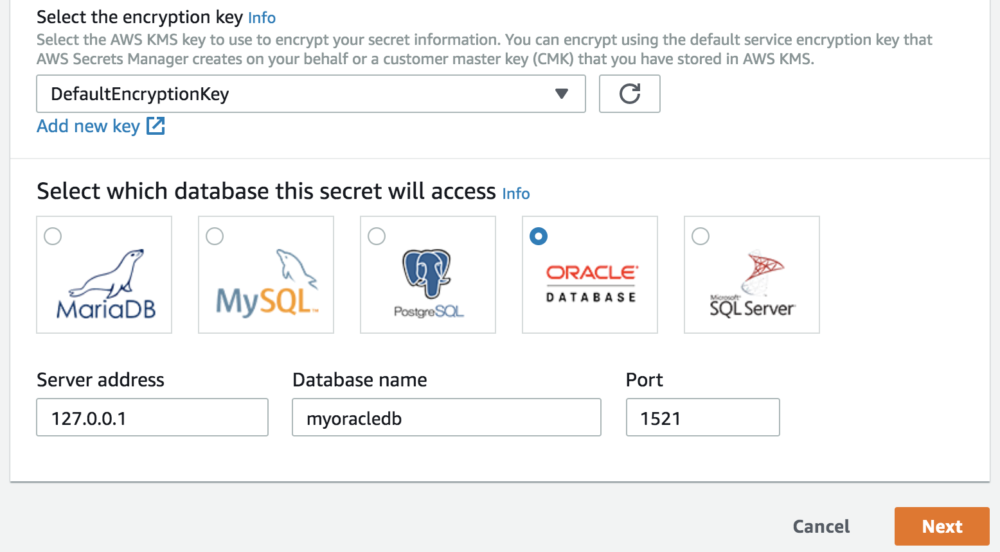
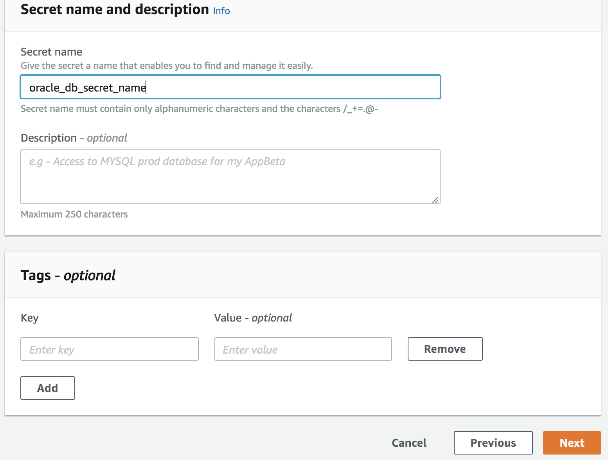
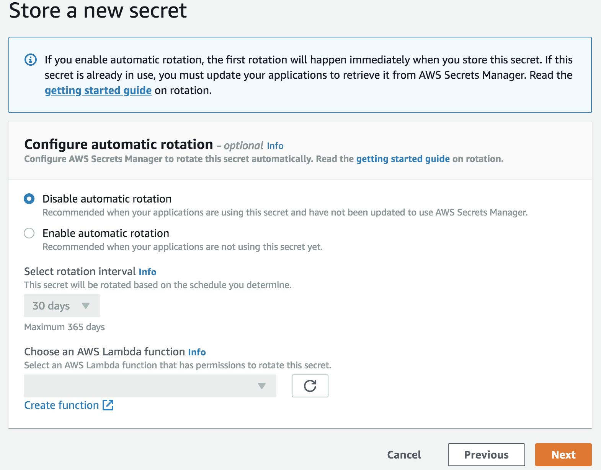

# AWS Lambda using Java, Oracle Database, and AWS Secrets Manager - Starter Kit

This is a Starter Kit for developing AWS Lambda based applications to work with Oracle database using Java and 
AWS Secrets Manager. It provides Oracle JDBC driver installation scripts, a Maven project with dependencies for AWS Lambda, AWS Secrets Manager, 
Oracle JDBC driver, and utility classes with the following functionalities:
1. Securely retrieve database credentials from AWS Secrets Manager
2. Establish database connectivity to Oracle Database e.g. Amazon RDS for Oracle

Using this, you can focus on developing your business logic without spending time in figuring out 
configuration and packaging of your AWS Lambda function.

This starter kit represents the following sample architecture scenario



## Pre-requisites
1. Apache Maven
2. Java SDK

## AWS Service Requirements
This starter kit requires the following AWS services
1. AWS Lambda
2. AWS Secrets Manager Secrets

## Oracle JDBC driver Installation
1. Download Oracle driver for Java from Oracle website https://www.oracle.com/database/technologies/jdbc-drivers-12c-downloads.html. Select the appropriate driver. For e.g. ojdbc7.jar
2. Install Oracle Driver to local Maven Environment using one of the scripts provided in this project
	1. For Mac OS or Unix or Linux - [install_oracle_jdbc_driver.sh](./src/main/resources/install_oracle_jdbc_driver.sh)
	2. For Windows - [install_oracle_jdbc_driver.bat](./AWSLambda-Java-Oracle-Quickstart/src/main/resources/install_oracle_jdbc_driver.bat)
3. Run the installation script. E.g. 
	```
	./install_oracle_jdbc_driver.sh /Users/user_name/Downloads/ojdbc7.jar
	```
4. Expected Output: it installs the jar file to local Maven repository path e.g. ```~/.m2/repository/com/oracle/jdbc/ojdbc/7/```
5. Note: The JDBC jar file can be referenced in the POM.xml using the following declaration
	```
	<!-- Dependency for Oracle JDBC driver -->
	<dependency>
		<groupId>com.oracle.jdbc</groupId>
		<artifactId>ojdbc</artifactId>
		<version>7</version>
	</dependency>
	```

## Build Instructions
1. The source code has Maven nature, you can build it using standard Maven commands e.g. ```mvn -X clean install```. or use the options available in your IDE
2. The above step generates a Jar file e.g. AWSLambda-Java-Oracle-Starter-1.0.jar

## Deploy Instructions
1. Setup AWS Secrets Manager Secret. This secrets has the credentials required to connect to Oracle Database
	1. Step 1 
	
	2. Step 2 
	
	
	4. Step 3 
	
	5. Step 4 
	
	6. Step 5 
	
2. Create Lambda Execution IAM Role and attach it to the Lambda function deployed.
3. Deploy **AWSLambdaOracleStarter** function
   	1. Runtime = Java 8
   	1. Function package = Use the Jar file generated. Refer section [Build Instructions](#Build-Instructions)
   	2. Lambda Handler = ```com.amazonaws.lambda.oracle.starter.AWSLambdaOracleStarter```
   	3. Timeout = e.g. 1 minute
	4. Memory = e.g. 128 MB
	5. Execution Role = created in Step # 2
	6. Environment variable = as defined in the following table

	| Variable Name                    	| Variable Value          					|
	|----------------------------------	|-------------------------					|
	| region                           	| e.g. us-east-1               				|
	| database_secret_name 				| Name of the AWS Secrets Manager Secret     |


## Best Practices
Security is important for developing applications on AWS. Please refer the following resources related to this topic.

1.	It is important to encrypt connection to a database. Refer the following resources from AWS 
	1. [Oracle Security](https://docs.aws.amazon.com/AmazonRDS/latest/UserGuide/CHAP_Oracle.html#Oracle.Concepts.RestrictedDBAPrivileges)
	2. [Oracle Secure Sockets Layer](https://docs.aws.amazon.com/AmazonRDS/latest/UserGuide/Appendix.Oracle.Options.SSL.html) for more details.
2.	Refer the following resources to know more about security concepts.
	1. [AWS Secrets Manager Best Practices](https://docs.aws.amazon.com/secretsmanager/latest/userguide/best-practices.html) 
	2. [Security in AWS Lambda](https://docs.aws.amazon.com/lambda/latest/dg/lambda-security.html)
	3. [Security Overview of AWS Lambda](https://d1.awsstatic.com/whitepapers/Overview-AWS-Lambda-Security.pdf)
3.	The scripts provided here will help install Oracle JDBC driver to a local Maven environment. 
However, for production use cases, the best practice is to maintain third-party libraries (that are not available on Maven central repository) 
is using Repository Manager within your organization. Refer Apache Maven's documentation for more details [here](https://maven.apache.org/repository-management.html).

## License Summary
This sample code is made available under the MIT license. See the LICENSE file.